# Image Directory for AccessAI/ALTernAtIve

This project contains categorized images organized into **STEM** and **non-STEM** folders. Below is a structured view with embedded previews for each image.

---

## Folder Structure

### Non-STEM Images

Images related to non-STEM topics, organized into subfolders by purpose or publication.

#### Folder: New

This folder contains recent images, along with generated captions.

- **Image:** `demo.jpg`  
  
  - **Generated Captions:**  
    - `generated_captions_for_demo.txt`

- **Image:** Youth Soccer  
  
  - **Description:** A moment captured in youth soccer, highlighting teamwork and active participation in sports.

- **Image:** Teens Sharing a Song  
  
  - **Description:** A candid moment of teens sharing music, showcasing social bonding through shared interests.

#### Folder: Paper

Images used in non-STEM papers.

- **Image:** `img10.jpg`  
  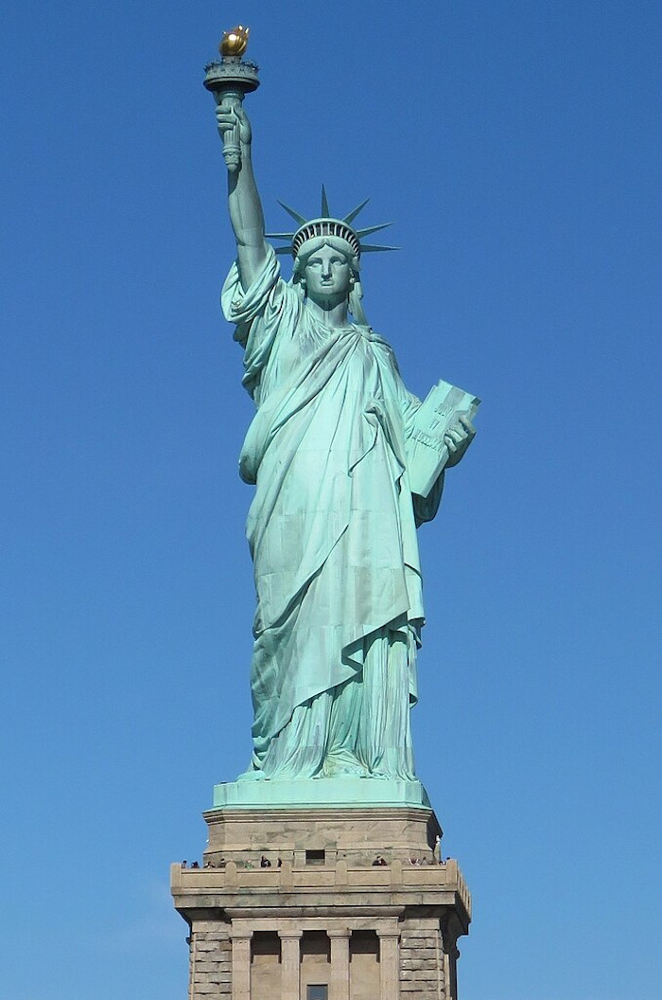
- **Image:** `img11.jpg`  
  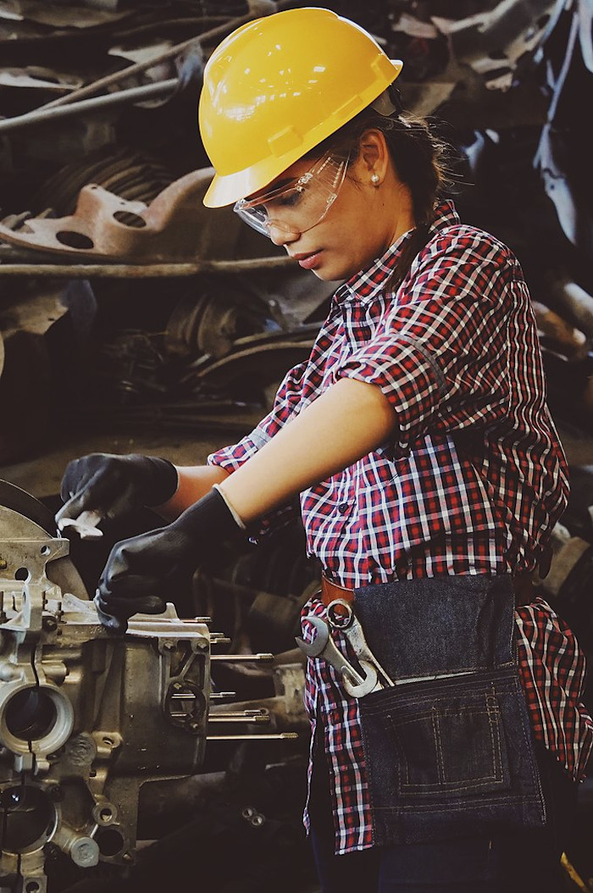
- **Image:** `img12.jpg`  
  

---

### STEM Images

Images related to STEM topics, with separate folders for new images and those used in research papers.

#### Folder: New

Recent STEM images, primarily figures from scientific publications. These captions are taken from [SciCap](https://github.com/tingyaohsu/SciCap):

- **Image:** `1010.2692v5-Figure1-1.png`  
  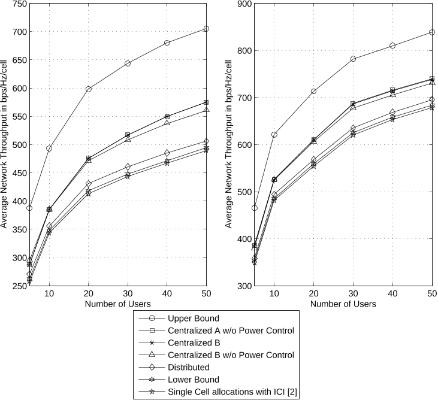
- **Image:** `1503.05526v1-Figure13-1.png`  
  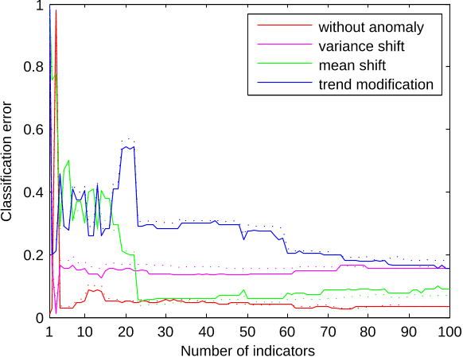
- **Image:** `1807.03337v2-Figure7-1.png`  
  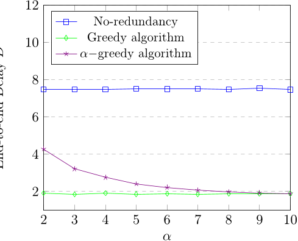
- **Image:** `1807.06391v1-Figure6-1.png`  
  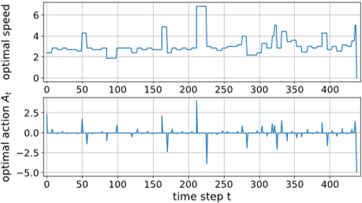
- **Image:** `2007.09948v2-Figure13-1.png`  
  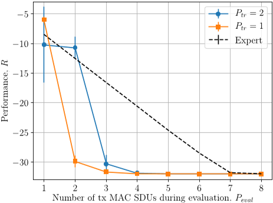
- **Image:** `2008.02400v1-Figure8-1.png`  
  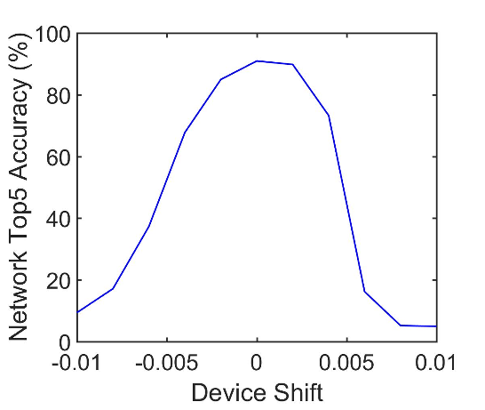

- **Image:** Coronavirus Structure  
  
  - **Description:** The structure of the SARS-CoV-2 virus, responsible for COVID-19.

- **Image:** Human Heart Diagram  
  
  - **Description:** A detailed diagram of the human heart, illustrating its anatomy.

- **Image:** Dolphin Anatomy  
  
  - **Description:** A comprehensive illustration of dolphin anatomy, showcasing key physiological features.

- **Image:** Mature Flower Structure  
  
  - **Description:** A botanical diagram that shows the structure of a mature flower.

- **Image:** Diffusion of Ideas  
  
  - **Description:** Visual representation of the diffusion of ideas, illustrating how concepts spread.

- **Image:** Chesapeake Waterbird Food Web  
  
  - **Description:** An ecological diagram showing the food web of waterbirds in Chesapeake Bay.

  - **Reference Captions:**  
    - `sciCap-images.txt` (Contains reference captions for these images)

#### Folder: Paper

Images used in various STEM publications.

- **Image:** `img1.png`  
  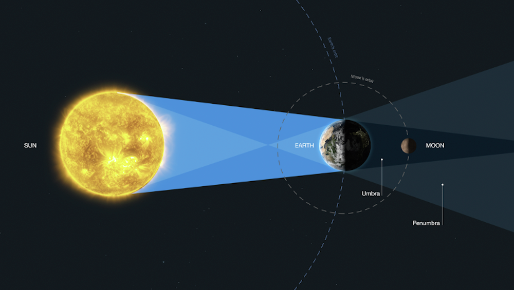
- **Image:** `img2.png`  
  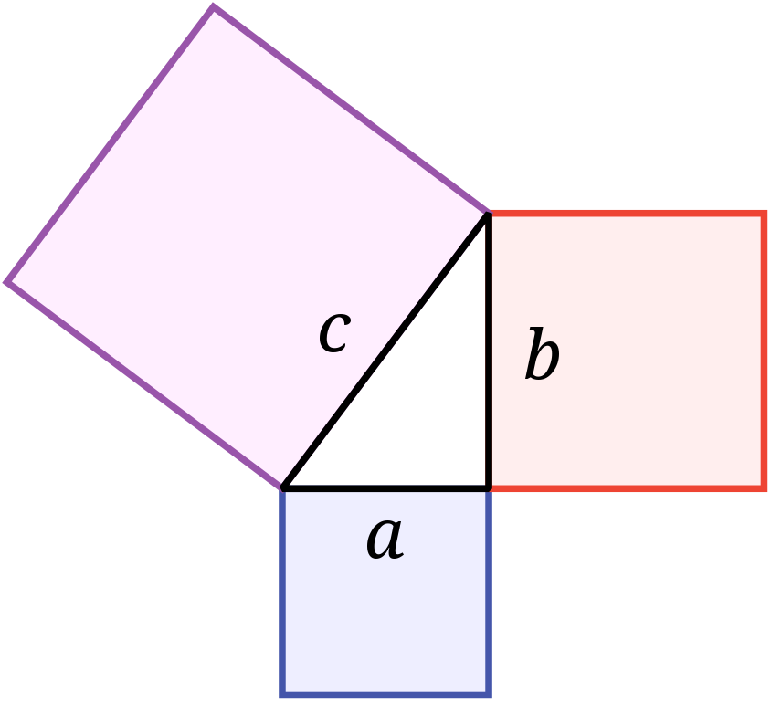
- **Image:** `img3.png`  
  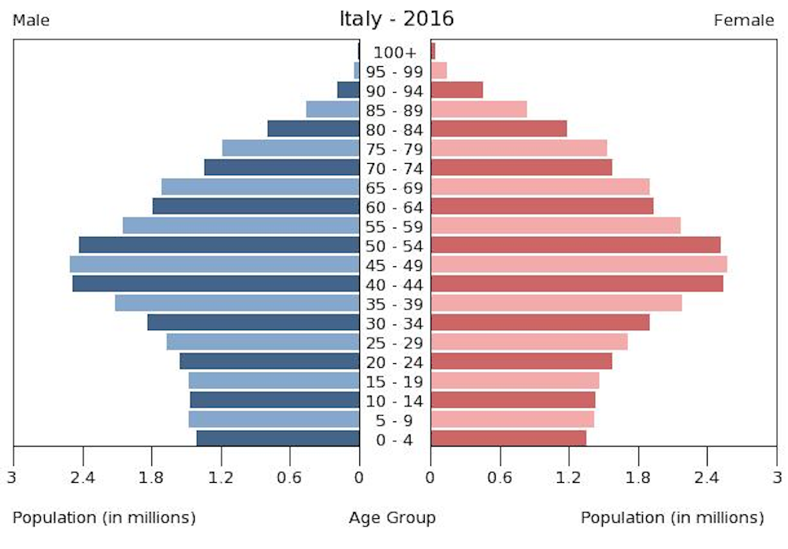
- **Image:** `img4.png`  
  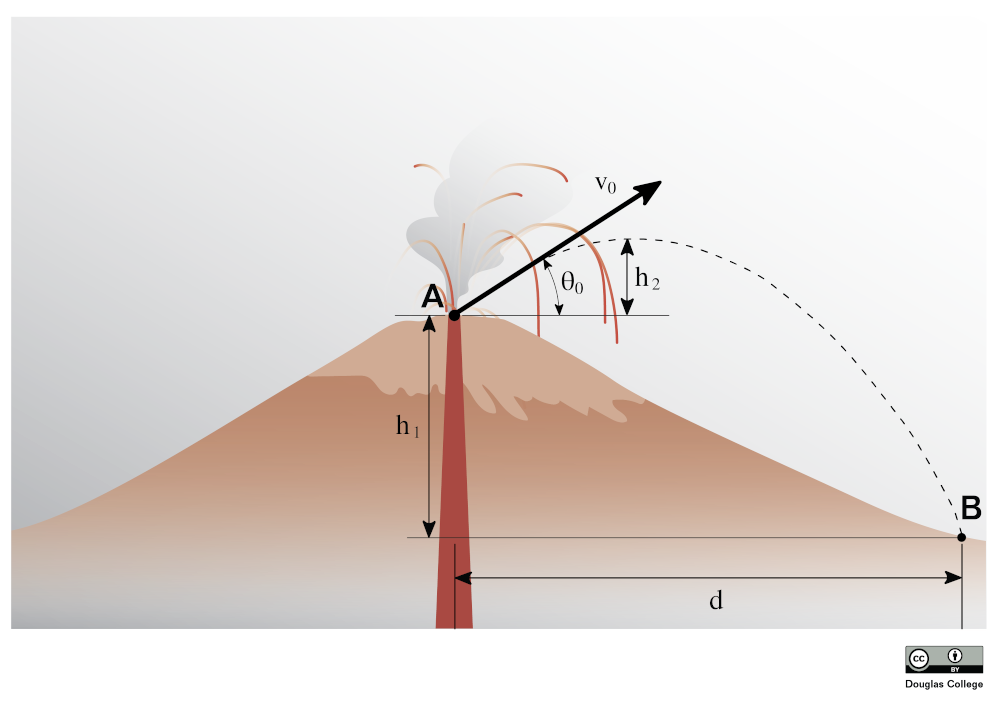
- **Image:** `img5.png`  
  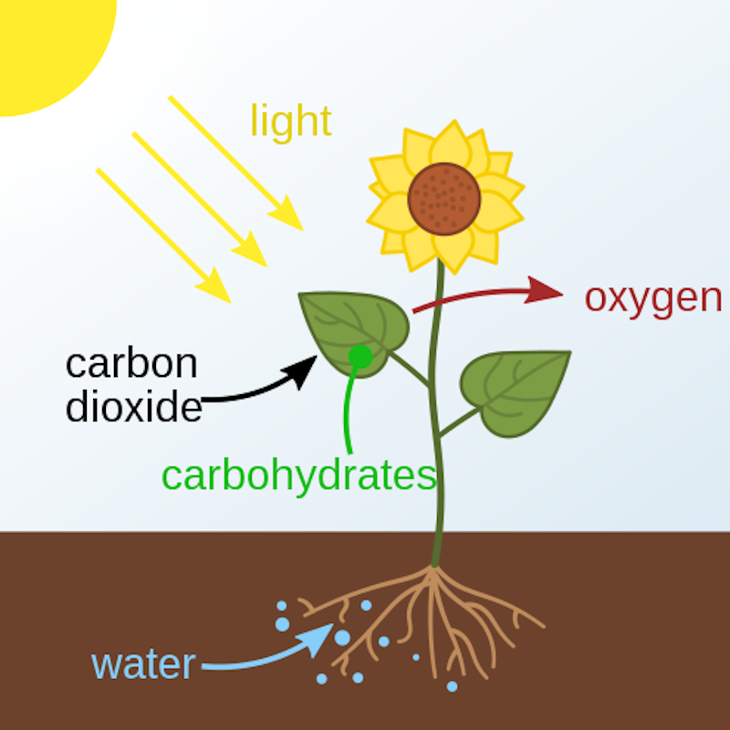
- **Image:** `img6.png`  
  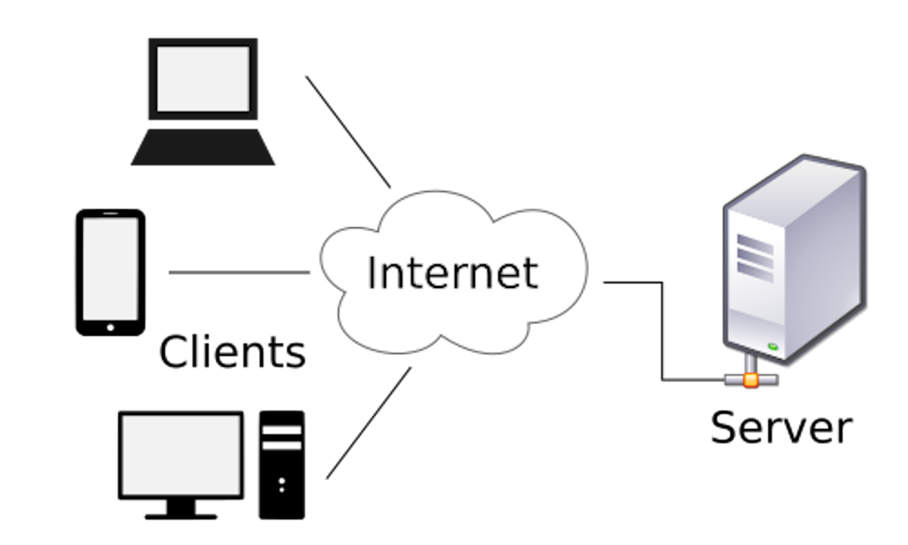
- **Image:** `img7.png`  
  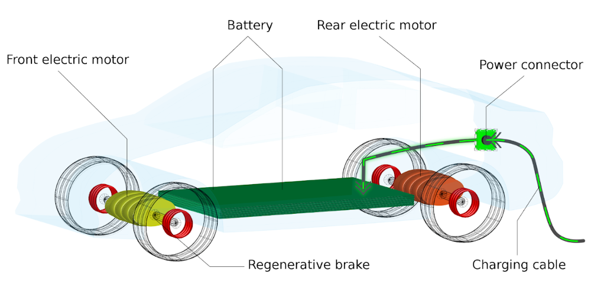
- **Image:** `img8.jpg`  
  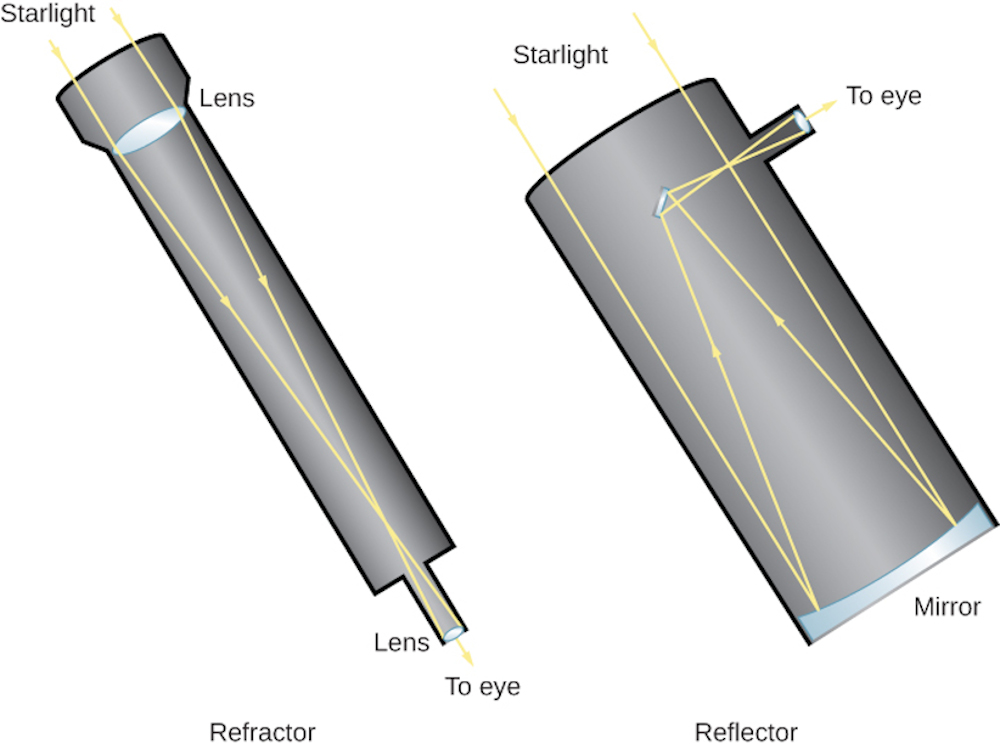
- **Image:** `img9.jpg`  
  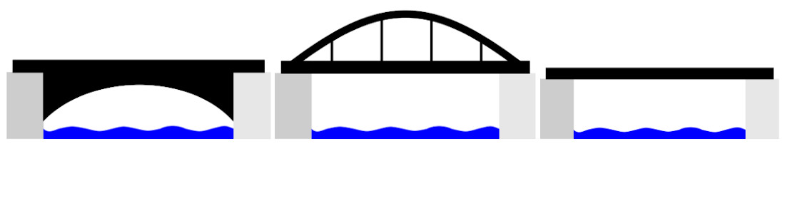